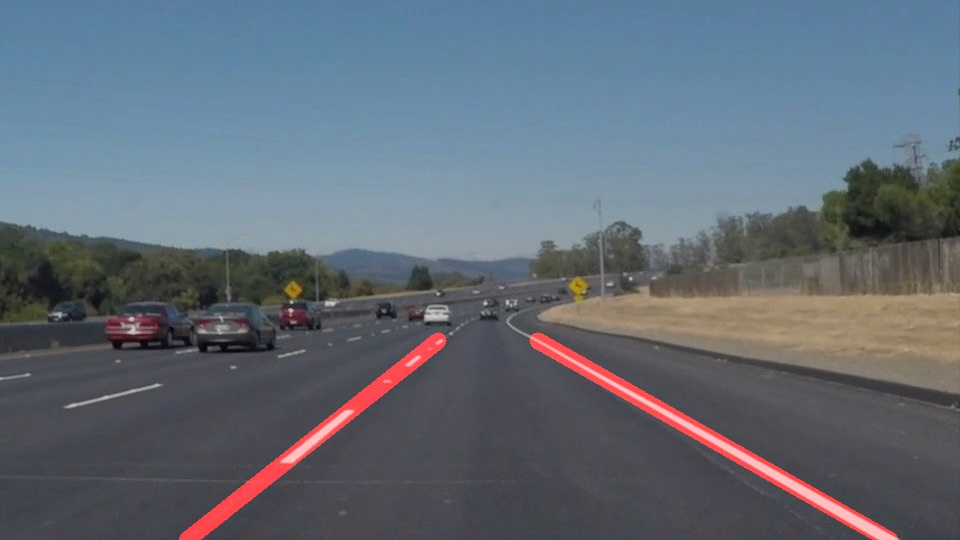

# Project 1 - Finding Lane Lines

## The goals / steps of this project are the following:

- Make a pipeline that finds lane lines on the road 
- Reflect on your work in a written report

## My pipeline consists of the following steps:
- Reading the original image.

- Gray scaling

- Gaussian smoothing

- Canny Edge Detection

- Setecting target region

## Modifyign draw lines function:

- Categorizing the line segment(s) from hough transform within the region of interest, into left lane, or right lane, using the slope. ( > -0.5, or < -0.1).
- From the array of left categoried line(s) picking the longest straight line, and using that as a reference left lane line to compute slope.
- Determining the point of intersection of the above reference line with region of interest's top line and bottom line and then connecting the intersection points to get a single left lane line.
- From the array of right categoried line(s) picking the longest straight line, and using that as a reference right lane line to compute slope.
- Determining the point of intersection of the above reference line with region of interest's top line and bottom line and then connecting the intersection points to get a single right lane line.

- Hough Transformation, drawing solid lines by extrapolating the points between the lane markers and overlaying lines on the original image 

## Output Videos:

- solidWhiteRight.mp4
- solidYellowLeft.mp4
- challenge.mp4

For the challenge video, I had to update the region of interest, since the video dimension(s) are different for this video

## Potential shortcomings:
- Dynamic region of interest has not yet implemented, therefore, the object with in the ROI can also be misinterpreted as a lane markers sometimes

## Potential improvements:

- smarter functions could be implemented under drawline function, that may drastically reduce the computational time
- The code is yet to be optimized for curves with higer radius of curvature 
